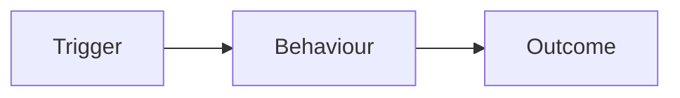

# <task-slug>: <one-line title>

<!--
This is the canonical linear42 spec scaffold. Copy it, then fill in every
section with concrete content, and create it as the Linear document "Spec"
(`linear document create --issue <KEY> --title Spec --content-file -`).
Linear does not validate it, so the discipline is yours: keep each H2 heading
below, in this order — Context, Goals, Acceptance Criteria, Design, Out of
Scope, Risks & Edge Cases, Open Questions. Write real content — no "TBD"/
"TODO"/"implement later" placeholders survive review.
-->

## Context

Why are we doing this, and what is the surrounding system? State the
concrete problem(s) motivating the task and the current behaviour that
falls short. Name the real files, commands, and constraints you verified
during exploration so the reader can ground every claim. This is the
shared understanding the whole plan builds on.

## Goals

The outcomes this task must achieve, stated as observable end states (not
implementation steps). Keep them outcome-focused so the Acceptance Criteria
below can test each one.

### Non-Goals

The things this task could plausibly include but deliberately leaves out,
to keep the lane tight. (This is distinct from "Out of Scope" below, which
captures broader boundaries; list the closely-related temptations here.)

## Acceptance Criteria

The checklist of what "done" looks like — each item testable and
unambiguous. Write them EARS-flavoured (Easy Approach to Requirements
Syntax): lead with the trigger or condition, then "THE SYSTEM SHALL ..."

- **WHEN** <event>, **THE SYSTEM SHALL** <required response>.
- **WHILE** <state>, **THE SYSTEM SHALL** <continuous behaviour>.
- **IF** <condition>, **THEN THE SYSTEM SHALL** <response>.
- **THE SYSTEM SHALL** <ubiquitous requirement that always holds>.

Number them (AC1, AC2, ...) so QA's per-AC walkthrough can reference each.

## Design

How we will build it. Lead with prose that explains the approach and the
key decisions, then give a file-change map so every reader knows exactly
what gets touched and why.

| Path | Responsibility |
|------|----------------|
| `path/to/file.swift` | What changes here and why |
| `path/to/other.md` | What changes here and why |

Include a visual when it sharpens shared understanding — strongly
encouraged for any non-trivial flow, state machine, or UI. Embed a fenced
`mermaid` diagram (flow / sequence / state / architecture) and/or reference
a confirmed planning artifact. A spec may reference confirmed planning
artifacts inline via `[[artifact:<id>]]` (e.g. `[[artifact:planning-diagram]]`) —
place each token alone on its own line. Workers will view each referenced
artifact before implementing to understand the visual decision it encodes.

## Out of Scope

What this task explicitly does NOT do. Draw the boundary so reviewers and
Workers do not expand the lane: adjacent features, follow-up work, and
alternatives considered and set aside.

## Risks & Edge Cases

What could go wrong, the edge cases that need handling, and the mitigation
for each. Cover failure modes, back-compat concerns, concurrency, and any
assumption that, if wrong, would change the design.

## Open Questions

Unresolved decisions that still need an answer. This section must be
**empty** to approve the plan — resolve each question with the user, fold
the answer into the relevant section above, and remove it from here. When
nothing is open, state that explicitly (e.g. "None — all resolved during
exploration").
